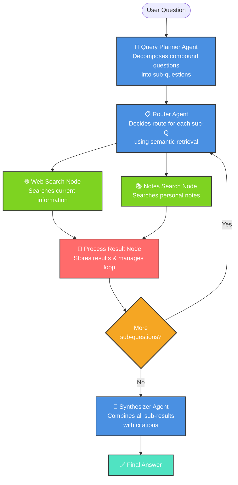

# Research Assistant

An agentic research assistant built with Python, LangGraph, and Streamlit. It decomposes a question into focused sub-questions, decides whether each one needs current web information or personal notes, and combines the results into one sourced answer.

## Features

- Query planning: breaks complex questions into up to three focused sub-questions.
- Per-question routing: chooses `web`, `notes`, or `both` for each sub-question.
- Personal knowledge base: searches local `.txt` and `.pdf` notes with semantic retrieval.
- Automatic note relevance: checks the Chroma vector store before allowing a notes-based route.
- Web research: uses Tavily with up to three search results per web query.
- Iterative LangGraph workflow: processes every planned sub-question before synthesis.
- Source-aware answers: labels each part of the final response as `Source: Web`, `Source: Notes`, or `Source: Web + Notes`.
- Streamlit interface: provides a simple question input, loading state, answer display, and research method summary.

## Architecture



## Project Structure

| File or directory | Purpose |
| --- | --- |
| `app.py` | Streamlit user interface |
| `graph.py` | LangGraph definition and public `run()` entry point |
| `nodes.py` | Planner, router, search, processing, and synthesis nodes |
| `deciders.py` | Conditional edge decisions and loop control |
| `tools.py` | Tavily web search and personal-note search tools |
| `rag.py` | Note ingestion, chunking, embeddings, Chroma retrieval, and note Q&A |
| `state.py` | Shared LangGraph state schema |
| `notes/` | Local `.txt` and `.pdf` files used as the personal knowledge base |
| `chroma_db/` | Locally persisted Chroma vector store |

## Tech Stack

- Python
- Streamlit
- LangGraph and LangChain
- Groq (`ChatGroq`) for planning, routing, and synthesis
- Tavily for web search
- Hugging Face `all-MiniLM-L6-v2` embeddings
- Chroma for persistent vector search

## Setup

1. Create and activate a virtual environment:

       ```bash
       python -m venv .venv
       ```

       On Windows PowerShell:

       ```powershell
       .\.venv\Scripts\Activate.ps1
       ```

2. Install the dependencies:

       ```bash
       pip install streamlit langgraph langchain-groq langchain-chroma langchain-huggingface langchain-community langchain-text-splitters tavily-python python-dotenv sentence-transformers pypdf
       ```

3. Create a `.env` file in the project root:

       ```dotenv
       GROQ_API_KEY=your_groq_api_key
       GROQ_MODEL=your_groq_model_name
       TAVILY_API_KEY=your_tavily_api_key
       ```

4. Put `.txt` or `.pdf` source material in `notes/`, then index it:

       ```bash
       python rag.py
       ```

       This splits the files into overlapping chunks, creates embeddings, and stores them in `chroma_db/`.

## Run the App

Start the Streamlit interface from the project root:

```bash
streamlit run app.py
```

Then enter a question such as:

```text
Compare supervised learning with the latest reinforcement learning techniques.
```

The app displays the synthesized answer and the overall method used: web search, personal notes, or both.

## Notes

- Note retrieval only uses files in `notes/` and searches the persisted `chroma_db/` collection.
- Run `python rag.py` again after adding new source files.
- The vector database, notes, virtual environment, and `.env` file are intentionally ignored by Git because they are local data or secrets.
- A valid Groq model name is required in `GROQ_MODEL`.
